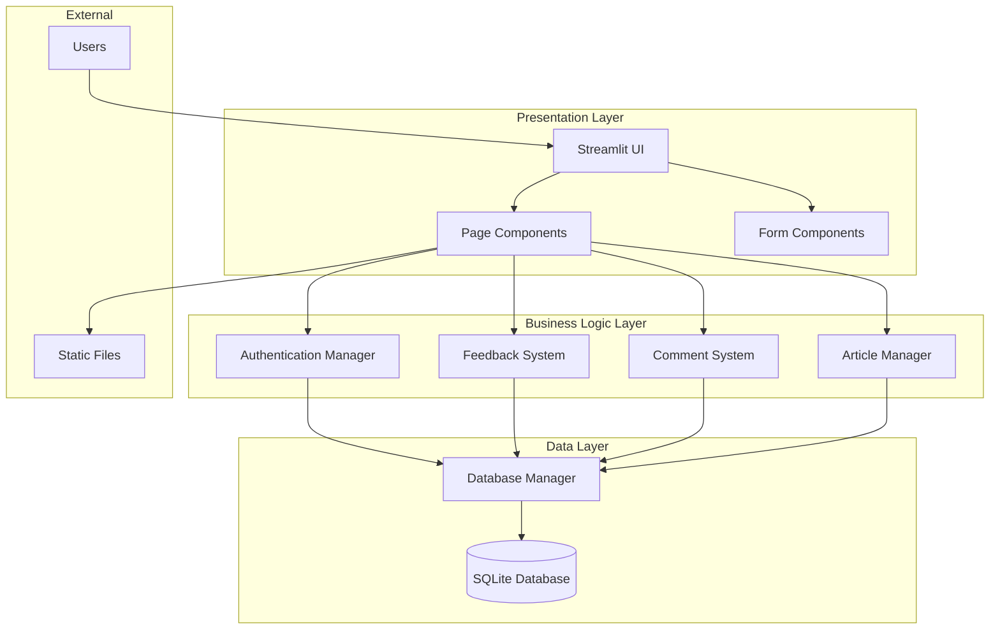

# Design Document

## Overview

The 广告思想简史 (Advertising History) platform is a comprehensive academic web application built with Streamlit that provides user authentication, content management, interactive feedback, and discussion capabilities. The system follows a modular architecture with clear separation of concerns between authentication, data management, user interface, and business logic components.

## Architecture

### System Architecture



### Component Architecture

The system is organized into distinct modules following the single responsibility principle:

- **modules/database.py**: Centralized data access and SQLite management
- **modules/auth.py**: User authentication and session management using streamlit-authenticator
- **modules/feedback.py**: Content rating and feedback collection using streamlit-feedback
- **modules/comments.py**: Discussion and comment threading system
- **modules/articles.py**: Article creation and management for professors
- **pages/**: Individual page components for different content sections
- **utils/**: Shared utilities and helper functions

## Components and Interfaces

### Database Manager (modules/database.py)

**Purpose**: Centralized database operations and schema management

**Key Classes**:
```python
class DatabaseManager:
    def __init__(self, db_path: str)
    def init_database(self) -> None
    def execute_query(self, query: str, params: tuple) -> pd.DataFrame
    def execute_update(self, query: str, params: tuple) -> int
    def get_connection(self) -> sqlite3.Connection
```

**Database Schema**:
- `user_feedback`: Stores user ratings and feedback
- `comments`: Threaded comment system with moderation
- `articles`: Professor-created content with workflow states
- `content_stats`: Aggregated engagement metrics
- `user_activity`: Audit log of all user actions

### Authentication Manager (modules/auth.py)

**Purpose**: User registration, login, and role-based access control

**Key Classes**:
```python
class AuthManager:
    def __init__(self, config_path: str)
    def login(self) -> tuple[str, bool, str]
    def logout(self) -> None
    def register_user(self) -> bool
    def get_user_role(self, username: str) -> str
    def is_professor_or_admin(self, username: str) -> bool
```

**User Roles**:
- **Student**: Content viewing, commenting, feedback submission
- **Professor**: All student features + article creation and management
- **Admin**: All features + user management and content moderation

### Feedback System (modules/feedback.py)

**Purpose**: Content rating and engagement tracking

**Key Classes**:
```python
class FeedbackSystem:
    def __init__(self, db_manager: DatabaseManager)
    def collect_feedback(self, target_type: str, target_id: str, feedback_type: str) -> None
    def show_feedback_stats(self, target_type: str, target_id: str) -> None
    def update_content_stats(self, target_type: str, target_id: str) -> None
```

**Feedback Types**:
- **Thumbs**: Binary like/dislike voting
- **Stars**: 1-5 star rating system
- **Faces**: Emoji-based sentiment rating

### Comment System (modules/comments.py)

**Purpose**: Discussion threads and user interaction

**Key Classes**:
```python
class CommentSystem:
    def __init__(self, db_manager: DatabaseManager)
    def display_comments_section(self, target_type: str, target_id: str) -> None
    def add_comment(self, username: str, target_type: str, target_id: str, content: str) -> bool
    def like_comment(self, comment_id: int, username: str) -> None
    def moderate_comments(self, username: str) -> None
```

**Comment Features**:
- Threaded replies with parent-child relationships
- Like/dislike functionality for individual comments
- Moderation queue for administrator review
- User avatar generation and comment attribution

### Article Manager (modules/articles.py)

**Purpose**: Content creation and publication workflow

**Key Classes**:
```python
class ArticleManager:
    def __init__(self, db_manager: DatabaseManager, auth_manager: AuthManager)
    def show_article_editor(self) -> None
    def save_article(self, title: str, content: str, category: str, tags: list, author: str, status: str) -> bool
    def show_article_list(self, status: str = None, author: str = None) -> None
    def moderate_articles(self, username: str) -> None
```

**Article Workflow**:
- **Draft**: Professor working copy, not visible to others
- **Review**: Submitted for administrator approval
- **Published**: Live content visible to all users
- **Archived**: Removed from public view but preserved

## Data Models

### User Feedback Schema
```sql
CREATE TABLE user_feedback (
    id INTEGER PRIMARY KEY AUTOINCREMENT,
    username TEXT NOT NULL,
    target_type TEXT NOT NULL,  -- 'timeline', 'figures', 'campaigns', 'article'
    target_id TEXT NOT NULL,    -- specific content identifier
    feedback_type TEXT NOT NULL, -- 'thumbs', 'stars', 'faces'
    feedback_value INTEGER,     -- rating value (0-1 for thumbs, 0-4 for stars/faces)
    feedback_text TEXT,         -- optional text feedback
    timestamp DATETIME DEFAULT CURRENT_TIMESTAMP,
    ip_address TEXT,
    user_agent TEXT
);
```

### Comments Schema
```sql
CREATE TABLE comments (
    id INTEGER PRIMARY KEY AUTOINCREMENT,
    username TEXT NOT NULL,
    target_type TEXT NOT NULL,
    target_id TEXT NOT NULL,
    content TEXT NOT NULL,
    timestamp DATETIME DEFAULT CURRENT_TIMESTAMP,
    likes INTEGER DEFAULT 0,
    parent_id INTEGER,          -- for threaded replies
    is_approved BOOLEAN DEFAULT 1,
    FOREIGN KEY (parent_id) REFERENCES comments (id)
);
```

### Articles Schema
```sql
CREATE TABLE articles (
    id INTEGER PRIMARY KEY AUTOINCREMENT,
    title TEXT NOT NULL,
    content TEXT NOT NULL,      -- markdown content
    excerpt TEXT,               -- auto-generated or manual summary
    category TEXT,              -- categorization for browsing
    tags TEXT,                  -- comma-separated tags
    author TEXT NOT NULL,
    status TEXT DEFAULT 'draft', -- 'draft', 'review', 'published', 'archived'
    created_at DATETIME DEFAULT CURRENT_TIMESTAMP,
    updated_at DATETIME DEFAULT CURRENT_TIMESTAMP,
    published_at DATETIME,
    views INTEGER DEFAULT 0,
    avg_rating REAL DEFAULT 0.0,
    total_feedback INTEGER DEFAULT 0
);
```

### Content Statistics Schema
```sql
CREATE TABLE content_stats (
    id INTEGER PRIMARY KEY AUTOINCREMENT,
    target_type TEXT NOT NULL,
    target_id TEXT NOT NULL,
    thumbs_up INTEGER DEFAULT 0,
    thumbs_down INTEGER DEFAULT 0,
    avg_stars REAL DEFAULT 0.0,
    total_ratings INTEGER DEFAULT 0,
    last_updated DATETIME DEFAULT CURRENT_TIMESTAMP,
    UNIQUE(target_type, target_id)
);
```

### User Activity Schema
```sql
CREATE TABLE user_activity (
    id INTEGER PRIMARY KEY AUTOINCREMENT,
    username TEXT NOT NULL,
    action TEXT NOT NULL,       -- 'login', 'comment', 'feedback', 'article_create', etc.
    target_type TEXT,
    target_id TEXT,
    details TEXT,               -- JSON or text details about the action
    timestamp DATETIME DEFAULT CURRENT_TIMESTAMP
);
```

## Correctness Properties

*A property is a characteristic or behavior that should hold true across all valid executions of a system-essentially, a formal statement about what the system should do. Properties serve as the bridge between human-readable specifications and machine-verifiable correctness guarantees.*

### Property 1: User Registration Data Integrity
*For any* valid registration data (email, name, password), the User_Management_System should create exactly one user account with the provided information stored correctly in the database
**Validates: Requirements 1.2**

### Property 2: Authentication Success Consistency
*For any* valid user credentials, the authentication system should consistently grant access and create a valid session
**Validates: Requirements 1.3**

### Property 3: Authentication Failure Security
*For any* invalid credentials, the authentication system should deny access and display appropriate error messages without revealing sensitive information
**Validates: Requirements 1.4**

### Property 4: Session Expiry Enforcement
*For any* expired user session, the system should require re-authentication before allowing access to protected features
**Validates: Requirements 1.5**

### Property 5: Role Permission Consistency
*For any* user with a specific role, the system should consistently enforce the same set of permissions across all platform features
**Validates: Requirements 2.1, 2.2, 2.3**

### Property 6: Access Control Enforcement
*For any* unauthorized action attempt, the system should deny access and provide clear permission error messages
**Validates: Requirements 2.4**

### Property 7: Feedback Uniqueness Constraint
*For any* user and content combination, the system should allow only one feedback submission and prevent duplicates
**Validates: Requirements 3.2**

### Property 8: Feedback Statistics Consistency
*For any* feedback submission, the content statistics should be updated immediately and accurately reflect all submitted feedback
**Validates: Requirements 3.3**

### Property 9: Comment Data Persistence
*For any* valid comment submission, the system should store the comment with correct timestamp, user attribution, and content
**Validates: Requirements 4.2**

### Property 10: Comment Threading Integrity
*For any* reply to a comment, the system should maintain proper parent-child relationships in the comment thread structure
**Validates: Requirements 4.4**

### Property 11: Article Status Workflow
*For any* article status change, the system should enforce proper workflow transitions and update visibility accordingly
**Validates: Requirements 5.2, 5.3**

### Property 12: Database Transaction Integrity
*For any* database operation, the system should either complete successfully or rollback completely, maintaining data consistency
**Validates: Requirements 6.2, 6.5**

### Property 13: User Interface Consistency
*For any* page navigation, the system should maintain consistent styling, layout, and navigation elements
**Validates: Requirements 7.1, 7.2**

### Property 14: Error Handling Completeness
*For any* error condition, the system should display user-friendly error messages and provide suggested recovery actions
**Validates: Requirements 7.4**

### Property 15: Activity Logging Completeness
*For any* user action, the system should log the activity with proper attribution, timestamp, and action details
**Validates: Requirements 9.1**

### Property 16: Moderation Queue Integrity
*For any* content requiring moderation, the system should add it to the appropriate moderation queue with proper categorization
**Validates: Requirements 10.1, 10.2**

## Error Handling

### Database Error Handling
- **Connection Failures**: Graceful degradation with user notification and retry mechanisms
- **Query Errors**: Proper error logging with sanitized user messages
- **Transaction Failures**: Automatic rollback with data integrity preservation
- **Schema Migrations**: Safe upgrade procedures with backup and recovery

### Authentication Error Handling
- **Invalid Credentials**: Clear error messages without information disclosure
- **Session Expiry**: Automatic redirect to login with context preservation
- **Permission Denied**: Informative messages with suggested actions
- **Registration Conflicts**: Duplicate email/username handling with alternatives

### User Input Validation
- **SQL Injection Prevention**: Parameterized queries and input sanitization
- **XSS Protection**: Content escaping and validation for user-generated content
- **File Upload Security**: Type validation and size limits for any future file features
- **Form Validation**: Client and server-side validation with clear error feedback

### System Error Recovery
- **Service Unavailability**: Graceful degradation with core functionality preservation
- **Resource Exhaustion**: Proper resource management and cleanup
- **External Dependencies**: Fallback mechanisms for third-party service failures
- **Data Corruption**: Detection and recovery procedures with integrity checks

## Testing Strategy

### Dual Testing Approach
The system will employ both unit testing and property-based testing to ensure comprehensive coverage:

- **Unit Tests**: Verify specific examples, edge cases, and error conditions
- **Property Tests**: Verify universal properties across all inputs using randomized testing
- **Integration Tests**: Verify component interactions and end-to-end workflows

### Property-Based Testing Configuration
- **Testing Framework**: Hypothesis for Python property-based testing
- **Minimum Iterations**: 100 iterations per property test to ensure statistical confidence
- **Test Tagging**: Each property test tagged with format: **Feature: platform-core, Property {number}: {property_text}**
- **Data Generation**: Smart generators for users, content, comments, and feedback data
- **Invariant Testing**: Focus on data integrity, permission consistency, and workflow correctness

### Unit Testing Focus Areas
- **Authentication Edge Cases**: Password validation, session management, role assignment
- **Database Operations**: CRUD operations, constraint enforcement, transaction handling
- **User Interface Components**: Form validation, navigation, responsive design
- **Content Management**: Article workflow, comment threading, feedback aggregation
- **Error Scenarios**: Network failures, invalid input, permission violations

### Testing Data Management
- **Test Database**: Isolated SQLite database for testing with automatic cleanup
- **Mock Data Generation**: Realistic test data for users, articles, comments, and feedback
- **State Management**: Proper test isolation and state reset between test runs
- **Performance Testing**: Response time validation for database operations and UI rendering